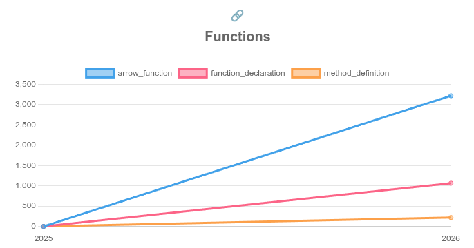

## 1. Repositório selecionado: https://github.com/openclaw/openclaw

## 2. Gráfico selecionado

## 3. Explicação:

O openclaw é um framework para criação de agentes que tem crescido absurdamente nesses últimos meses, contando com mais de 50 contribuições por dia, o que provavelmente reflete um desenvolvimento com auxílio de inteligência artificial. Por ser um projeto recente e muito ativo, é um repositório relevante para análise de evolução de código.

A inexistência de picos de crescimento no número de funções indica que o desenvolvimento do projeto é consistente e comprova o desenvolvimento massivo atual.

O gráfico apresenta o número de funções criadas ao longo do tempo e o tipo delas. Percebe-se uma tendência de criação de funções do tipo `arrow_function`, que é geralmente mais rápida de escrever, fato que também pode ser um reflexo do uso de IA, que aprendeu melhor esse padrão por ser mais utilizado e passou a recomendá-lo com mais frequência.

Além disso proporção entre os tipos se mantém constante ao longo de todo o período: `arrow_function` representa aproximadamente 3x mais funções que `function_declaration`, e cerca de 15x mais que `method_definition`. A baixíssima presença de `method_definition` indica que o projeto adota uma arquitetura predominantemente funcional, com pouco uso de classes e orientação a objetos, o que é consistente com padrões modernos de TypeScript/JavaScript.

